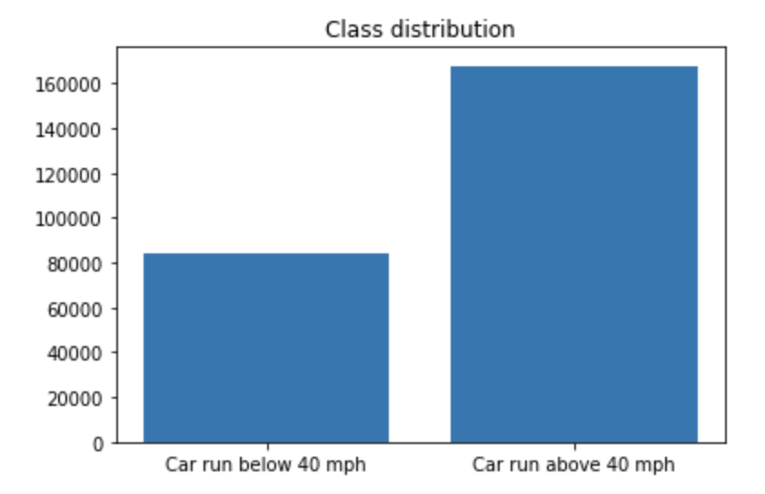
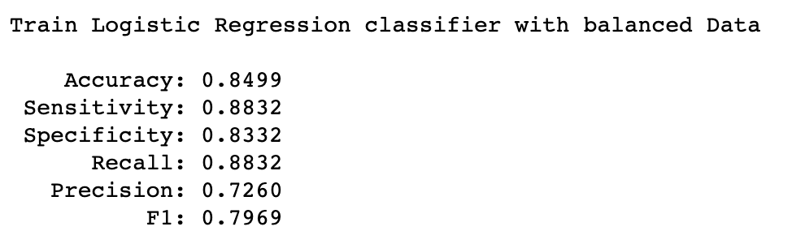
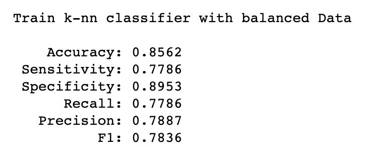
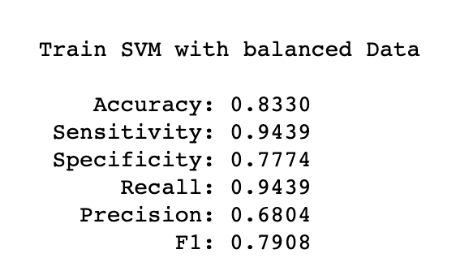
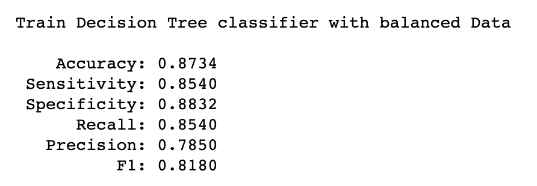
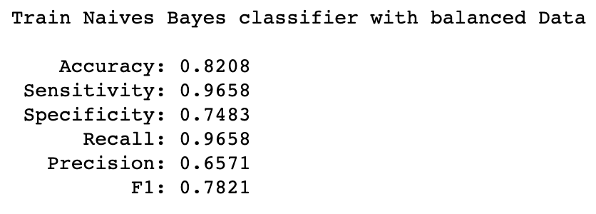

# **Development of predictive model**

## **Balancing our traffic dataset**

As we see in the table 41, our classification problem contains imbalanced classes. So, we must balance our classes by using Synthetic Minority oversampling the minority class to have 20 percent the majority class and under sampling the majority class to have 50 percent more the minority class.

Table 42. Summary of prior probabilities of balanced traffic data set

Class |	Count |	%
--------|--------|--------
Class1 |	83942  |	33.33
Class2 |	167884 |	66.67

 
 Figure 16. Class distribution of balanced data

## **Machine Learning Models for classification**

**1. Logistic Regression model**

 

After using the hold-out protocol and performing the Logistic Regression classifier for the balanced data set we found the following metrics:

 
 Figure 17. Metrics for balanced traffic data set after carrying out Logistic Regression classifier

**2. k-nn model**
 

After using the hold-out protocol and performing the k-nn classifier using the 3 nearest neighbors for the balanced data set we found the following metrics:

 
 Figure 18. Metrics for balanced traffic data set after carrying out k-nn classifier

**3. SVM model**
 

After using the hold-out protocol and carrying out the SVM classifier for the balanced data set we found the following metrics:

 
 Figure 19. Metrics for balanced traffic data set after carrying out SVM classifier.

**4.Decision Tree model**
 

After using the hold-out protocol and carrying out the Decision Tree classifier for the balanced data set we found the following metrics:

 
 Figure. 20. Metrics for balanced traffic data set after carrying out Decision Tree classifier

**5. Naive Bayes model**
 

After using the hold-out protocol and carrying out the Naive Bayes classifier for the balanced data set we found the following metrics:

 
 Figure. 21. Metrics for balanced traffic data set after carrying out Naive Bayes classifier

 
Table 43. Summary of metrics across the classifiers

Metrics |	Logistic Regression |	k-nn | SVM | Decision Tree | Naive Bayes
--------|--------|--------|--------|--------|--------
Accuracy %  |   84.99 | 85.62 | 83.30 | 87.34 | 82.08
Sensitivity | 0.8832 | 0.7786 | 0.7786 | 0.8540 | 0.9658
Specificity | 0.8332 | 0.8953 | 0.7774 | 0.8832 | 0.7483
Precision | 0.7260 | 0.7887 | 0.6804 | 0.6804 | 0.6571
F1 | 0.7969 | 0.7836 | 0.7908 | 0.8180 | 0.7821

