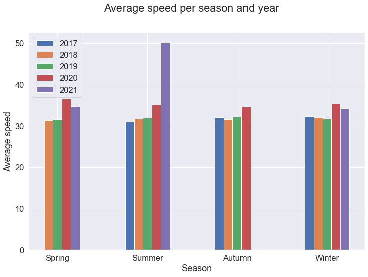
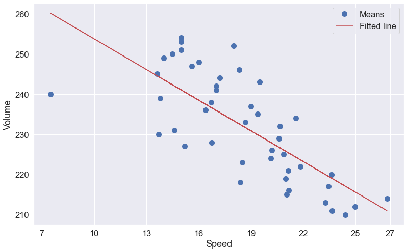
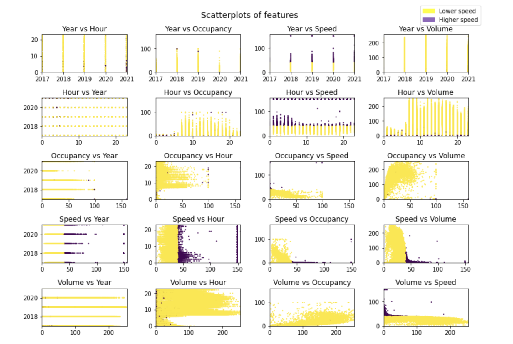

# **Exploratory Analysis**
* Plot histogram to show the frequency of cars across different speeds and all the years.
* Develop the following data distribution graphs:
    - Distribution based on month and average speed.
    - Distribution based on season and average speed.
    - Distribution based on day of week and average speed.
* Key statistics of the selected features to look for patterns and
explore data distribution.
* Create some scatterplots of these features to find the potential
features are to contribute the predictive model.
* Evaluate if the traffic dataset is balanced.

## **Data distributions of average speed per years**

 
 Figure 1. Data distribution of car’s speed across the years.

 
 
 Figure 2. Data distribution of car’s speed across 2017

 

Figure1 and Figure2 show there were few cars travelled at speed less than 20 miles per hour from 2017 to 2021. Also, Figure1 depicts most cars run at a speed more than 30 mph and less than 40 mph which is the official speed limit. Additionally, there were few cars surpassed the speed limit and another small group of cars that run at a higher speed limit between 140 mph and 150 mph across all the years.
Notice there are few records about car’s speed in 2017 since the dataset only contains data from July 2017. Because of that, we have few cars that run lower than 20 mph and higher than 14 mph in 2017.
Additionally, note we have a similar number of cars that exceeds the speed of 140 mph between 2018 and 2019. However, this number increased significantly between 2020 and 2021, one year after the lockdown. 

## **Data distributions**
###  **Distribution based on month**

 
 Figure 3. Distribution of average speed per month and year.

 

Figure above depicts the average speed values from July 2017 to September 2021. The highest average speed value is registered in September 2021 with a value of 63 mph. Also, notice the average speed values are similar between 31 and 32 mph from January to November 2018 and January to November 2019. Additionally, the months of September, October and November depicts similar average speed values between 31 and 32 mph 2017, 2018 and 2019.
Additionally, there were no readings about car’s speed since October to December of 2021 and January to June 2017 because this dataset contains data registered since July 2017 until September 2021.
Finally, there were not readings from December 2019 to March 2020 and no reason was found in the metadata to justify these missed readings.

### **Distribution based on season**

 
 Figure 4. It depicts average speed values per season and year

 

Above figure shows the highest average speed value of 50 mph in Summer 2021.
Winter, Spring, Autumn and Summer seasons of 2018 and 2019 depict similar values between 31 and 32 mph. Similarly, Summer, Autumn and Winter of 2017, 2018 and 2019 present similar values between 31 and 32 mph. Also, notice there are no values in Spring 2017 because this data was registered from July 2017 and likewise Autumn 2021 since this data was registered until September 2021.

### **Distribution based on day of week**

 
 Figure 5. It shows average speed per day of week and year.

 

Above figure depicts a highest average speed of 43 mph on Wednesday, also notice the average value of 42 mph registered on Friday and Tuesday which are close to the highest value. Moreover, the average speed is similar from Monday to Sunday 2017, 2018 and 2019, since this value is between 31 and 32 mph. Notice that graph depicts similar speed values between all the days of week since 2017 to 2019. Although we have a slight increase in speed for 2020 and 2021, the average speed between days of week are similar in each year.

### **Distribution based on hour**

 
 Figure 6. It shows average speed per hour and year.

 

The graph shows that cars run at average speed less than 40 mph the 24h of the day since 2017 to 2019. Hence, that could mean the junction had heavy traffic all day during these years. However, average speed surpassed speed limit from 1 am to 8 am of 2020 and 2021 and it could mean traffic flowed smoothly during these hours. Additionally, note the pattern in the last two years, where average speed increases above the speed limit from 1 am and then decreases below this limit at 9 am and it stays in this way until 11 pm, that means people used to run at higher speed at early hours in the morning when the junction is not busy.

## **Key statistics of the selected features**
Table below shows the main features used for our analysis.

Table 8. Features used during the experiments
*#* |  *Selected Features*  
--------|--------
1 | Year
2 | Hour
3 | Occupancy
4 | Speed
5 | Volume

We plotted Boxplots to check the range of values of features, mean and standard deviation values, also to analyse the distribution of the features.

### **Boxplot based on Year and Speed**

 
 Figure 7. Boxplot of speed values per year from Traffic dataset

 
Table 9. Summary for the speed values of cars from 2017 to 2021.

 Elements |*2017* | *2018* | *2019* | *2020* | *2021*
 --------|--------|--------|--------|--------|--------
 count | 58,200.00 | 110,756.00 | 87,576.00 | 93,420.00 | 87,948.00
 mean | 31.65 | 31.71 | 31.86 | 35.37 | 39.78
 std | 8.58 | 8.31 | 8.49 | 16.58 | 16.58
 min | 0.00 | 2.00 | 4.00 | 0.00 | 3.00
 25% | 29.00 | 29.00 | 29.00 | 31.00 | 29.00
 50% | 31.00 | 31.00 | 31.00 | 33.00 | 32.00
 75% | 34.00 | 34.00 | 34.00 | 35.00 | 35.00
 max | 155.00 | 149.00 | 149.00 | 149.00 | 149.00

 Table 10. Summary for the average speed values of vehicles on junction La Mar-Menchaca from 2017 to 2021.

 Elements |*Value*
 --------|--------
 count | 437,900.00
 mean | 34.07
 min | 1.80
 25% | 29.40
 50% | 31.60
 75% | 34.40
 max | 150.20

 

Above table shows that average minimum and maximum speed values are about 2 and about 150 mph respectively. Moreover, 75% numbers of vehicles travelled at an average speed less than 34 mph which means just 25% of cars run at a speed greater than 34 mph. Also, notice all boxplots represent some outliers with values greater than 41 mph.

### **Boxplot based on Hour and Speed**

 
  Figure 8. Boxplot of speed values across hours from Traffic dataset

 
Table 11. Summary for the speed values of cars run on junction La Mar – Menchaca from 00:00 to 06:00

 Elements |*00:00* | *01:00* | *02:00* | *03:00* | *04:00* | *05:00* | *06:00*
 --------|--------|--------|--------|--------|--------|--------|--------
 count | 18,060.00 | 17,916.00 | 17,744.00 | 18,588.00 | 18,572.00 | 18,228.00
 mean | 35.02 | 36.58 | 38.44 | 42.76 | 44.57 | 39.94 | 37.19
 std | 13.53 | 18.11 | 22.97 | 31.92 | 33.87 | 25.51 | 17.92
 min | 5.00 | 6.00 | 0.00 | 2.00 | 4.00 | 5.00 | 10.00
 25% | 31.00 | 31.00 | 31.00 | 31.00 | 31.00 | 31.00 | 32.00
 50% | 33.00 | 34.00 | 34.00 | 34.00 | 35.00 | 35.00 | 35.00
 75% | 36.00 | 37.00 | 37.00 | 38.00 | 39.00 | 38.00 | 37.00
 max | 149.00 | 149.00 | 149.00 | 149.00 | 149.00 | 149.00 | 149.00

 Table 12. Summary for the speed values of cars run on junction La Mar – Menchaca from 07:00 to 13:00

Elements | 07:00 |	08:00 |	09:00 |	10:00 |	11:00 |	12:00 |	13:00
--------|--------|--------|--------|--------|--------|--------|--------
count |	18,256.00 |	18,272.00 |	18,304.00 |	18,280.00 |	18,188.00 |	18,204.00 |	18,324.00
mean |	35.89 |	34.03 |	33.53 |	33.33 |	32.33 |	30.55 |	30.00
std | 15.61 | 14.80 | 12.72 | 11.83 | 11.07 | 10.58 | 9.75
min | 3.00 | 6.00 |	7.00 |	7.00 |	5.00 |	6.00 |	3.00
25% | 32.00 | 31.00 | 31.00 | 30.00 | 30.00 | 28.00 | 28.00
50% | 34.00 | 33.00 | 32.00 | 32.00 | 31.00 | 30.00 | 29.00
75% | 36.00 | 35.00 | 34.00 | 34.00 | 33.00 | 32.00 | 31.00
max | 149.00 | 149.00 | 149.00 | 149.00 | 149.00 | 149.00 |	149.00

Table 13. Summary for the speed values of car that run on junction La Mar – Menchaca from 14:00 to 20:00

Elements | 14:00 | 15:00 |	16:00 |	17:00 |	18:00 |	19:00 |	20:00
--------|--------|--------|--------|--------|--------|--------|--------
count |	18,332.00 |	18,364.00 |	18,380.00 |	18,308.00 |	18,292.00 |	18,296.00 |	18,212.00
mean |	30.57 |	30.54 |	30.02 |	29.55 |	29.93 |	30.96 |	32.31
std | 10.12 |	10.09 |	11.12 |	10.07 |	10.42 |	11.03 |	11.30
min | 3.00 | 4.00 |	4.00 |	6.00 |	4.00 |	0.00 |	9.00
25% |	28.00 |	28.00 |	27.00 |	26.00 |	27.00 |	28.00 |	30.00
50% |	30.00 |	30.00 |	29.00 |	29.00 |	29.00 |	30.00 |	31.00
75% |	32.00 |	32.00 |	31.00 |	31.00 |	32.00 |	32.00 |	33.00
max |	149.00 | 149.00 | 149.00 |	149.00 | 149.00 | 155.00 | 149.00

Table 14. Summary for the speed values of cars run on junction La Mar – Menchaca from 21:00 to 23:00

Elements | 21:00 |  22:00 |	23:00
--------|--------|--------|--------
count |	18,192.00 |	18,172.00 |	18,128.00
mean | 32.81 |	33.81 |	34.49
std | 12.60 |	13.09 |	13.19
min | 7.00 |	13.00 |	12.00
25% | 30.00 |	31.00 |	31.00
50% | 32.00 |	32.00 |	33.00
75%	| 33.00 |	34.00 |	35.00
max | 149.00 | 	149.00 | 149.00

Table 15. Summary for the average speed values of vehicles on junction La Mar-Menchaca from 00:00 to 23:00.

Elements | Values
--------|--------
count |	437,900.00
mean |	34.19
min	| 4.71
25%	| 29.62
50%	| 31.86
75%	| 34.29
max	| 149.29
 

Above table shows that average minimum and maximum speed values are about 4 and 149 mph respectively. Moreover, 75% numbers of vehicles travelled at an average speed less than 34 mph which means just 25% of cars run at a speed greater than 34 mph. Also, notice cars run more than 40 mph, which the official speed limit, from 23:00 to 08:00.

 ### **Boxplot based on Speed and Occupancy**
 For the current section we used the definition of occupancy as the ratio of the sum of the lengths of the vehicles to the length of the road section in which those vehicles are present.

 
  Figure 9. Boxplot of speed values across occupancy from Traffic dataset

 

The following tables shows key statistics about speed between different ranges of lane’s occupancy.

 

 Table 16. Summary for the speed values of cars run on junction La Mar – Menchaca when occupancy of the lane is between 0 and 6
 	
Elements | 0 | 1 |	2 |	3 |	4 |	5 |	6 
--------|--------|--------|--------|--------|--------|--------|--------
count |	121,993.00 | 39,754.00 | 26,876.00 | 24,423.00 | 26,640.00 | 29,900.00 | 30,743.00 
mean |	42.25 |	33.56 |	33.19 |	32.83 |	32.48 |	32.11 |	31.47 
std |	30.32 |	3.25 |	2.93 |	2.77 |	2.58 |	2.42 |	2.29 
min	| 0.00 | 6.00 |	11.00 |	5.00 |	14.00 |	4.00 |	7.00 
25%	| 31.00 | 32.00 |	31.00 |	31.00 |	31.00 |	30.00 |	30.00
50%	| 35.00	| 33.00 |	33.00 |	33.00 |	32.00 |	32.00 |	31.00 
75%	| 38.00	| 36.00 |	35.00 |	35.00 |	34.00 |	34.00 |	33.00 
max	| 149.00 | 149.00 |	44.00 |	42.00 |	41.00 |	40.00 |	40.00 

Table 17. Summary for the speed values of cars run on junction La Mar – Menchaca when occupancy of the lane is between 7 and 13

Elements |	7 |	8 |	9 |	10 |	11 |	12 |	13
--------|--------|--------|--------|--------|--------|--------|--------
count |	28,774.00 |	25,671.00 |	21,811.00 |	17,516.00 |	13,387.00 |	9,807.00 |	6,885.00
mean |	30.78 |	30.06 |	29.37 |	28.70 |	28.14 |	27.55 |	27.00
std |	2.20 |	2.17 |	2.14 |	2.13 |	2.17 |	2.14 |	2.20
min |	6.00 |	6.00 |	12.00 |	16.00 |	5.00 |	18.00 |	14.00
25% |	29.00 |	29.00 |	28.00 |	27.00 |	27.00 |	26.00 |	26.00
50% |	31.00 |	30.00 |	29.00 |	29.00 |	28.00 |	28.00 |	27.00
75% |	32.00 |	32.00 |	31.00 |	30.00 |	30.00 |	29.00 |	29.00
max |	39.00 |	65.00 |	37.00 |	37.00 |	36.00 |	35.00 |	34.00

Table 18. Summary for the speed values of cars run on junction La Mar – Menchaca when occupancy of the lane is between 14 and 20

Elements |	14 |	15 |	16 |	17 |	18 |	19 |	20
--------|--------|--------|--------|--------|--------|--------|--------
count |	4,660.00 |	2,927.00 |	1,880.00 |	1,055.00 |	636.00 |	377.00 |	275.00
mean |	26.57 |	26.18 |	25.54 |	25.00 |	24.43 |	23.84|	23.05
std |	2.20 |	2.16 |	2.22 |	2.38 |	2.91 |	2.64 |	2.90
min |	9.00 |	12.00 |	6.00 |	6.00 |	3.00 |	15.00 |	13.00
25% |	25.00 |	25.00 |	24.00 |	23.00 |	23.00 |	22.00 |	21.00
50% |	27.00 |	26.00 |	26.00 |	25.00 |	25.00 |	24.00 |	23.00
75% | 28.00 |	28.00 |	27.00 |	27.00 |	26.00 |	25.00 |	25.00
max |	35.00 |	33.00 |	36.00 |	34.00 |	32.00 |	33.00 |	35.00

Table 19. Summary for the speed values of cars run on junction La Mar – Menchaca when occupancy of the lane is between 21 and 27

Elements |	21 |	22 |	23 |	24 |	25 |	26 |	27
 --------|--------|--------|--------|--------|--------|--------|--------
count |	156.00 |	131.00 |	99.00 |	108.00 |	62.00 |	71.00 |	66.00
mean |	22.96 |	21.59 |	21.97 |	21.31 |	21.50 |	20.28 |	19.94
std |	2.61 |	3.65 |	4.45 |	4.18 |	4.01 |	3.68 |	5.07
min |	15.00 |	4.00 |	9.00 |	10.00 |	14.00 |	4.00 |	4.00
25% |	21.00 |	20.00 |	20.00 |	19.00 |	19.00 |	18.00 |	18.00
50% | 23.00 |	22.00 |	21.00 |	21.00 |	21.00 |	20.00 |	20.00
75% |	25.00 |	24.00 |	23.00 |	23.00 |	24.00 |	22.00 |	22.00
max |	32.00 |	30.00 |	48.00 |	37.00 |	34.00 |	33.00 |	33.00

Table 20. Summary for the speed values of cars run on junction La Mar – Menchaca when occupancy of the lane is between 28 and 34

Elements |	28 |	29 |	30 |	31 |	32 |	33 |	34
--------|--------|--------|--------|--------|--------|--------|--------
count |	60.00 |	46.00 |	65.00 |	43.00 |	45.00 |	46.00 |	39.00
mean |	20.63 |	18.52 |	18.48 |	17.51 |	17.56 |	17.61 |	17.15
std |	4.88 |	3.52 |	4.66 |	4.71 |	4.06 |	4.11 |	5.91
min |	13.00 |	8.00 |	6.00 |	8.00 |	5.00 |	9.00 |	6.00
25% |	17.75 |	17.00 |	17.00 |	15.00 |	15.00 |	15.25 |	14.00
50% |	19.00 |	19.00 |	19.00 |	17.00 |	18.00 |	17.00 |	17.00
75% |	23.00 |	20.00 |	21.00 |	20.00 |	19.00 |	19.00 |	19.50
max |	37.00 |	31.00 |	30.00 |	30.00 |	31.00 |	31.00 |	32.00

Table 21. Summary for the speed values of cars run on junction La Mar – Menchaca when occupancy of the lane is between 35 and 41

Elements |	35 |	36 |	37 |	38 |	39 |	40 |	41
--------|--------|--------|--------|--------|--------|--------|--------
count |	39.00 |	36.00 |	41.00 |	47.00 |	41.00 |	49.00 |	47.00
mean |	16.33 |	16.17 |	16.29 |	15.47 |	15.10 |	13.82 |	14.02
std |	3.83 |	5.47 |	5.25 |	6.17 |	3.74 |	4.04 |	3.27
min |	9.00 |	5.00 |	5.00 |	6.00 |	5.00 |	5.00 |	7.00
25% |	13.50 |	14.00 |	14.00 |	12.00 |	13.00 |	12.00 |	13.00
50% |	16.00 |	16.00 |	16.00 |	15.00 |	15.00 |	14.00 |	14.00
75%	| 18.00 |	18.00 |	17.00 |	17.50 |	16.00 |	126.00 |	15.00
max |	29.00 |	32.00 |	38.00 |	32.00 |	27.00 |	26.00 |	27.00

Table 22. Summary for the speed values of cars run on junction La Mar – Menchaca when occupancy of the lane is between 42 and 48

Elements |	42  |	43 |	44 |	45 |	46 |	47 |	48
--------|--------|--------|--------|--------|--------|--------|--------
count |	38.00 |	36.00 |	39.00 |	39.00 |	31.00 |	36.00 |	26.00
mean |	14.76 |	14.03 |	12.69 |	12.69 |	13.87 |	11.89 |	11.96
std |	3.09 |	5.55 |	3.86 |	3.33 |	4.02 |	2.45 |	4.75
min |	6.00 |	6.00 |	4.00 |	7.00 |	9.00 |	7.00 |	5.00
25% |	14.00 |	12.00 |	11.00 |	10.50 |	12.00 |	10.00 |	9.25
50%	 | 14.50 |	14.00 |	13.00 |	13.00 |	13.00 |	12.00 |	11.50
75% |	16.00 |	16.00 |	14.00 |	14.50 |	 15.00 |	14.00 |	14.00
max |	21.00 |	40.00 |	29.00 |	24.00 |	29.00 |	16.00 |	30.00

Table 23. Summary for the speed values of cars run on junction La Mar – Menchaca when occupancy of the lane is between 49 and 55

Elements |	49 |	50 |	51 |	52 |	53 |	54 |	55
--------|--------|--------|--------|--------|--------|--------|--------
count |	34.00 |	36.00 |	22.00 |	20.00 |	28.00 |	21.00 |	9.00
mean |	11.59 |	11.83 |	11.05 |	11.25 |	11.25 |	11.62 |	11.44
std |	3.95 |	3.15 |	3.59 |	5.28 |	4.42 |	6.49 |	8.31
min |	5.00 |	3.00 |	5.00 |	5.00 |	7.00 |	6.00 |	6.00
25% |	9.25 |	10.00 |	9.00 |	7.75 |	8.00 |	8.00 |	8.00
50% |	12.00 |	13.00 |	11.00 |	12.00 |	9.50 |	11.00 |	9.00
75% |	12.00 |	13.25 |	12.00 |	13.00 |	13.00 |	11.00 |	10.00
max |	28.00 |	21.00 |	22.00 |	29.00 |	24.00 |	31.00 |	33.00

Table 24. Summary for the speed values of cars run on junction La Mar – Menchaca when occupancy of the lane is between 56 and 62

Elements |	56 |	57 |	58 |	59 |	60 |	61 |	62
--------|--------|--------|--------|--------|--------|--------|--------
count |	16.00 |	12.00 |	15.00 |	11.00 |	8.00 |	7.00 |	7.00
mean |	9.94 |	9.67 |	9.20 |	10.73 |	11.88 |	11.00 |	14.43
std |	2.02 |	2.19 |	2.65 |	4.88 |	9.72 |	10.12 |	7.93
min |	7.00 |	6.00 |	4.00 |	4.00 |	5.00 |	4.00 |	9.00
25% |	8.00 |	8.75 |	7.00 |	8.50 |	6.00 |	6.00 |	10.50
50% |	10.00 |	9.50 |	10.00 |	10.00 |	7.00 |	7.00 |	12.00
75%	 | 11.25 |	11.00 |	11.00 |	12.00 |	13.50 |	10.50 |	13.50
max |	13.00 |	14.00 |	13.00 |	23.00 |	28.00 |	33.00 |	32.00

Table 25. Summary for the speed values of cars run on junction La Mar – Menchaca when occupancy of the lane is between 63 and 69

Elements |	63 |	64 |	65 |	66 |	67 |	68 |	69
--------|--------|--------|--------|--------|--------|--------|--------
count |	5.00 |	7.00 |	3.00 |	2.00 |	4.00 |	3.00 |	3.00
mean |	10.20 |	15.14 |	23.00 |	8.00 |	13.25 |	14.67 |	13.33
std |	1.92 |	8.75 |	8.66 |	20.50 |	9.22 |	12.90 |	0.58
min |	8.00 |	6.00 |	13.00 |	4.00 |	6.00 |	4.00 |	13.00
25% |	9.00 |	8.50 |	20.50 |	6.00 |	9.22 |	7.50 |	13.00
50% |	10.00 |	14.00 |	28.00 |	8.00 |	10.50 |	11.00 |	13.00
75%	| 11.00 |	21.00 |	28.00 |	10.00 |	17.00 |	20.00 |	13.50
max	| 13.00 |	27.00 |	28.00 |	12.00 |	26.00 |	29.00 |	14.00

Table 26. Summary for the speed values of cars run on junction La Mar – Menchaca when occupancy of the lane is between 71 and 78

Elements |	71 |	72 |	73 |	74 |	75 |	76 |	78
--------|--------|--------|--------|--------|--------|--------|--------
count |	3.00 |	2.00 |	4.00 |	3.00 |	1.00 |	2.00 |	1.00
mean |	14.67 |	17.00 |	10.25 |	14.00 |	10.00 |	18.00 |	5.00
std |	9.87 |	12.73 |	11.18 |	6.93 |	- |	14.14 |	-
min |	8.00 |	8.00 |	4.00 |	6.00 |	10.00 |	8.00 |	5.00
25% |	9.00 |	12.50 |	4.75 |	12.00 |	10.00 |	13.00 |	5.00
50% |	10.00 |	17.00 |	5.00 |	18.00 |	10.00 |	18.00 |	5.00
75% |	18.00 |	21.50 |	10.50 |	18.00 |	10.00 |	23.00 |	5.00
max |	26.00 |	26.00 |	27.00 |	18.00 |	10.00 |	28.00 |	5.00

Table 27. Summary for the speed values of cars run on junction La Mar – Menchaca when occupancy of the lane is between 79 and 90

Elements |	79 |	80 |	84 |	87 |	88 |	89 |	90
--------|--------|--------|--------|--------|--------|--------|--------   
count |	2.00 |	1.00 |	1.00 |	2.00 |	2.00 |	1.00 |	1.00
mean |	31.00 |	11.00 |	12.00 |	7.50 |	88.00 |	38.00 |	27.00
std |	0.00 |	- |	- |	0.71 |	86.27 |	- |	-
min |	31.00 |	11.00 |	12.00 |	7.00 |	27.00 |	38.00 |	27.00
25% |	31.00 |	11.00 |	12.00 |	7.25 |	57.50 |	38.00 |	27.00
50% |	31.00 |	11.00 |	12.00 |	7.50 |	88.00 |	38.00 |	27.00
75% |	31.00 |	11.00 |	12.00 |	7.75 |	118.50 |	38.00 |	27.00
max	 | 31.00 |	11.00 |	12.00 |	8.00 |	149.00 |	38.00 |	27.00

Table 28. Summary for the speed values of cars run on junction La Mar – Menchaca when occupancy of the lane is between 91 and 160

Elements |	91 |	94 |	96 |	97 |	99 |	100 | 160
--------|--------|--------|--------|--------|--------|--------|-------- 
count |	2.00 |	1.00 |	5.00 |	1.00 |	17.00 |	2.00 |	1.00
mean |	19.00 |	14.00 |	22.20 |	11.00 |	45.65 |	17.00 |	155.00
std |	12.73 |	- |	7.79 |	- |	59.35 |	8.49 |	-
min |	10.00 |	14.00 |	11.00 |	11.00 |	6.00 |	11.00 |	155.00
25% |	14.50n | 14.00 |	18.00 |	11.00 |	12.00 |	14.00 |	155.00
50% |	19.00 |	14.00 |	25.00 |	11.00 |	14.00 |	17.00 |	155.00
75% |	23.50 |	14.00 |	26.00 |	11.00 |	29.00 |	20.00 |	155.00
max |	28.00 |	14.00 |	31.00 |	11.00 |	149.00 |	23.00 |	155.00

Table 29. Summary for the average speed values of vehicles on junction La Mar-Menchaca when occupancy of this is between 0 and 160.

Elements | Values
--------|--------
count |	437,900.00
mean v	21.23
min |	10.32
25% |	18.29
50% |	20.53
75% |	24.14
max |	35.33
 

Above table shows that average minimum and maximum speed values are about 10 and 35 mph respectively. Moreover, 75% numbers of vehicles travelled at an average speed less than 24 mph which means just 25% of cars run at a speed greater than 24 mph. Also, notice cars run more than 40 mph, which the official speed limit, when the occupancy is between 0 and 4. Moreover, we can see that few cars run at a higher speed of 149 mph when the occupancy is 88, which is an unusual case.

### **Boxplot based on Speed**

 
  Figure 10. Boxplot of speed values from Traffic dataset

 Table 30. Summary for the speed values of vehicles on junction La Mar- Menchaca

Elements | Values
--------|--------
count |	437,900.00
mean |	34.13
std |	17.04
min |	0.00
25% |	29.00
50% |	32.00
75% |	34.00
max |	155.00

The previous boxplot and table show that 75% of the cars run at a speed less than 34 mph and just 25% of the cars run at a speed more than 34 mph and less than 41 mph. Also, notice some outliers which are greater than 41 mph and others that are lower than 22 mph.

### **Boxplot based on Volume between 0 and 13, and Speed**
For the current and next sections we used the definition of volume as the number of vehicles detected by the sensor, in the last 15 minutes.

 
  Figure 11. Boxplot of speed and volume between 0 and 13 vehicles per minute from Traffic dataset

 

As we see in the above boxplot, when the junction volume is zero, the mean average speed is above 140 mph.
Also, the mean average speed is uniform and less than 40 mph across the volume between 1 and 13. Moreover, the maximum speed value is above 40 mph and below 60 mph when the volume is between 1 and 13 mph. But notice the presence of outliers with values above 140 mph between 1 and 5 mph, 8 mph, 10 to 11 mph.

Table 31. Summary for the speed values of cars run on junction La Mar–Menchaca when volume of the intersection is between 0 and 6

Elements |	0 |	1 |	2 |	3 |	4 |	5 |	6
--------|--------|--------|--------|--------|--------|--------|--------
count |	8,664.00 |	8,823.00 |	11,767.00 |	12,248.00 |	11,694.00 |	10,318.00 |	8,789.00
mean |	148.98 |	34.97 |	33.18 |	33.39 |	33.68 |	33.87 |	34.02
std |	1.40 |	18.57 |	8.72 |	6.15 |	5.39 |	5.04 |	4.58
min |	19.00 |	2.00 |	0.00 |	6.00 |	6.00 |	11.00 |	12.00
25% |	149.00 |	27.00 |	29.00 |	30.00 |	30.00 |	31.00 |	31.00
50% |	149.00 |	33.00 |	33.00 |	34.00 |	34.00 |	34.00 |	34.00
75%	 | 149.00 |	39.00 |	37.00 |	37.00 |	37.00 |	37.00 |	37.00
max |	149.00 |	155.00 |	149.00 |	149.00 |	149.00 |	149.00 |	74.00

Table 32. Summary for the speed values of cars run on junction La Mar–Menchaca when volume of the intersection is between 7 and 13

Elements |	7 |	8 |	9 |	10 |	11 |	12 |	13
--------|--------|--------|--------|--------|--------|--------|--------
count |	7,512.00 |	6,600.00 |	5,825.00 |	5,213.00 |	4,657.00 |	4,263.00 |	4,134.00
mean |	34.14 |	34.11 |	34.17 |	34.11 |	34.24 |	34.07 |	34.05
std |	4.23 |	4.34 |	3.97 |	4.13 |	4.05 |	3.64 |	3.58
min |	14.00 |	11.00 |	7.00 |	16.00 |	13.00 |	14.00 |	12.00
25% |	31.00 |	31.00 |	32.00 |	32.00 |	32.00 |	32.00 |	32.00
50% |	34.00 |	34.00 |	34.00 |	34.00 |	34.00 |	34.00 |	34.00
75% |	37.00 |	37.00 |	37.00 |	37.00 |	37.00 |	36.00 |	36.00
max |	85.00 |	149.00 |	57.00 |	149.00 |	149.00 |	51.00 |	63.00

### **Boxplot based Speed and Volume between 210 and 255**

 
 Figure 12. Boxplot of speed and volume between 210 and 255 vehicles per minute from Traffic dataset

 
 Figure 13. Graph depicts the least square trendline of the means from the speed and volume between 210 and 255.

 
 Figure 14. Image shows the correlation coefficient between Speed and Volume.

Notice the above graph show the best fitted line across the means from speed and volume between 210 and 255. Also, a correlation coefficient between the two features was computed, and we obtained a value close to -1. So, our data is well fitted to a line with negative slope.

As we see in the above boxplot, the mean average speed value decreases from 23 mph to 17 mph when the junction’s volume increases from 214 to 255. Also, we could see few outliers below 40 mph.

Table 33. Summary for the speed values of cars run on junction La Mar – Menchaca when volume of the intersection is between 210 and 216

Elements |	210 |	211 |	212 |	213 |	214	| 215 |	216
--------|--------|--------|--------|--------|--------|--------|--------
count |	27.00 |	28.00 |	32.00 |	21.00 |	16.00 |	20.00 |	19.00
mean |	24.41 |	23.64 |	24.97 |	23.29 |	26.81 |	21.05 |	21.16
std |	6.36 |	5.86 |	5.23 |	6.15 |	4.81 |	5.79 |	5.72
min |	5.00 |	12.00 |	14.00 |	12.00 |	16.00 |	13.00 |	12.00
25% |	21.00 |	18.75 |	22.00 |	18.00 |	26.50 |	15.75 |	17.00
50% |	28.00 |	24.50 |	26.00 |	24.00 |	27.50 |	21.00 |	22.00
75% |	29.00 |	28.00 |	29.00 |	28.00 |	29.50 |	25.25 |	25.50
max |	30.00 |	34.00 |	31.00 |	32.00 |	32.00 |	32.00 |	30.00

Table 34. Summary for the speed values of cars run on junction La Mar – Menchaca when volume of the intersection is between 217 and 223

Elemets |	217 |	218 |	219 |	220 |	221 |	222 |	223
--------|--------|--------|--------|--------|--------|--------|--------
count |	18.00 |	21.00 |	13.00 |	13.00 |	7.00 |	12.00 |	14.00
mean |	23.44 |	18.38 |	21.00 |	23.62 |	21.14 |	21.83 |	18.50
std |	5.71 |	6.45 |	6.30 |	6.08 |	5.15 |	5.54 |	6.56
min |	11.00 |	4.00 |	11.00 |	14.00 |	13.00 |	14.00 |	12.00
25% |	21.00 |	14.00 |	15.00 |	19.00 |	19.00 |	17.75 |	13.00
50% |	23.50 |	19.00 |	21.00 |	26.00 |	20.00 |	23.00 |	16.50
75% |	27.75 |	23.00 |	27.00 |	28.00 |	24.50 |	25.00 |	25.25
max |	32.00 |	30.00 |	29.00 |	33.00 |	28.00 |	31.00 |	28.00

Table 35. Summary for the speed values of cars run on junction La Mar – Menchaca when volume of the intersection is between 224 and 230

Elements |	224	 | 225 |	226 |	227 |	228 |	229 |	230
--------|--------|--------|--------|--------|--------|--------|--------
count |	13.00 |	9.00 |	5.00 |	5.00 |	8.00 |	10.00 |	7.00
mean |	20.15 |	20.89 |	20.20 |	15.20 |	16.75 |	20.60 |	13.71
std |	6.32 |	7.37 |	6.53 |	4.15 |	3.54 |	5.70 |	2.21
min |	12.00 |	12.00 |	13.00 |	10.00 |	11.00 |	12.00 |	11.00
25% |	14.00 |	16.00 |	17.00 |	12.00 |	15.25 |	17.00 |	12.00
50% |	20.00 |	18.00 |	18.00 |	16.00 |	17.00 |	21.50 |	14.00
75% |	26.00 |	29.00 |	23.00 |	18.00 |	18.50 |	22.75 |	15.00
max |	30.00 |	31.00 |	30.00 |	20.00 |	22.00 |	30.00 |	17.00

Table 36. Summary for the speed values of cars run on junction La Mar – Menchaca when volume of the intersection is between 231 and 237

Elements |	231 |	232 |	233 |	234	 | 235 |	236 |	237
--------|--------|--------|--------|--------|--------|--------|--------
count |	5.00 |	3.00 |	6.00 |	7.00 |	8.00 |	5.00 |	2.00
mean |	14.60 |	20.67 |	18.67 |	21.57 |	19.38 |	16.40 |	19.00
std |	2.41 |	6.51 |	3.01 |	4.28 |	4.69 |	3.85 |	8.49
min |	12.00 | 14.00 |	14.00 |	17.00 |	11.00 |	13.00 |	13.00
25% |	13.00 |	17.50 |	17.50 |	19.00 |	17.00 |	15.00 |	16.00
50% |	14.00 |	21.00  | 19.00 |	19.00 |	19.00 |	15.00 |	19.00
75% |	16.00 |	24.00 |	19.75 |	24.00 |	22.75 |	16.00 |	22.00
max |	18.00 |	27.00 |	23.00 |	29.00 |	25.00 |	23.00 |	25.00

Table 37. Summary for the speed values of cars run on junction La Mar – Menchaca when volume of the intersection is between 238 and 244

Elements |	238 |	239 |	240 |	241 |	242 |	243 |	244
--------|--------|--------|--------|--------|--------|--------|--------
count |	7.00 |	5.00 |	2.00 |	4.00 |	4.00 |	2.00 |	5.00
mean |	16.71 |	13.80 |	7.50 |	17.00 |	17.00 |	19.50 |	17.20
std | 5.56 |	3.19 |	4.95 |	3.83 |	4.08 |	0.71 |	3.56
min	12.00 |	10.00 |	4.00 |	12.00 |	14.00 |	19.00 |	12.00
25% |	15.00 |	12.00 |	5.75 |	15.00 |	14.75 |	19.25 |	15.00
50% |	15.00 |	13.00 |	7.50 |	18.00 |	15.50 |	19.50 |	19.00
75% |	15.50 |	16.00 |	9.25 |	20.00 |	17.75 |	19.75 |	20.00
max |	29.00 |	18.00 |	11.00 |	20.00 |	23.00 |	20.00 |	20.00

Table 38. Summary for the speed values of cars run on junction La Mar – Menchaca when volume of the intersection is between 245 and 251

Elements |	245 |	246 |	247 |	248 |	249 |	250 |	251
--------|--------|--------|--------|--------|--------|--------|--------
count |	5.00 |	3.00 |	5.00 |	2.00 |	1.00 |	2.00 |	3.00
mean |	13.60 |	18.33 |	15.60 |	16.00 |	14.00 |	14.50 |	15.00
std |	6.31 |	1.53 |	2.51 |	1.41 |	- |	3.54 |	4.00
min |	4.00 |	17.00 |	14.00 |	15.00 |	14.00 |	12.00 |	11.00
25% |	13.00 |	17.50 |	14.00 |	15.50 |	14.00 |	13.25 |	13.00
50% |	13.00 |	18.00 |	15.00 |	16.00 |	14.00 |	14.50 |	15.00
75% | 17.00 |	19.00 |	15.00 |	16.50 |	14.00 |	15.75 |	17.00
max |	21.00 |	20.00 |	20.00 |	17.00 |	14.00 |	17.00 |	19.00

Table 39. Summary for the speed values of cars run on junction La Mar – Menchaca when volume of the intersection is between 252 and 255

Elements |	252 |	253 |	254 |	255
--------|--------|--------|--------|--------   
count |	4.00 |	1.00 |	1.00 |	1.00
mean |	18.00 |	15.00 |	15.00 |	13.00
std |	3.16 |	- |	- |	-
min |	15.00 |	15.00 |	15.00 |	13.00
25% |	15.75 |	15.00 |	15.00 |	13.00
50% |	17.50 |	15.00 |	15.00 |	13.00
75% |	19.75 |	15.00 |	15.00 |	13.00
max |	22.00 |	15.00 |	15.00 |	13.00

Table 40. Summary for the average speed values of vehicles on junction La Mar-Menchaca when volume of this is between 0 and 255.

Elements | Values
--------|--------
count |	437,900.00
mean |	28.66
min |	10.72
25% |	25.96
50% |	28.60
75% |	30.92
max |	40.57

Above table shows that average minimum and maximum speed values are about 10 and 41 mph respectively. Moreover, 25% numbers of vehicles travelled at an average speed more than 30 mph. Also, notice cars run more than 40 mph, when the volume is between 0 and 40 and between 51 and 52.

## **Exploring scatterplots of features**

Also, scatterplots of the data were plotted by every pair of features to identify the correlation between every pair of features.

  
   Figure 15. Image depicts scatterplots by every pair of features: Year, Hour, Occupancy, Speed and Volume.

 

The above figure shows scatterplots by every pair of features. Notice the following key facts of the above scatterplots:

1. Hour vs Occupancy: It shows a positive correlation. But it won’t be possible to predict the speed validity if the two features are used together.
2. Hour vs Speed: It doesn’t show any correlation. However, if the two features are considered then it would be possible to predict when a car run at a higher or lower speed than the speed limit.
3. Hour vs Volume: It depicts a positive correlation. Nevertheless, if the two variables are considered then it won’t be possible to predict when a car run a speed lower or higher than the speed limit.
4. Occupancy vs Hour: It shows positive correlation. But it won’tbe possible to predict the speed validity if the two features are considered.
5. Occupancy vs Speed: It shows a negative correlation. However, it won’t be possible to predict the speed validity if the two features are used.
6. Occupancy vs Volume: It depicts a negative correlation. Also, these two features might be useful to predict the speed validity.
7. Speed vs Hour: It shows a negative correlation. Additionally, these two features might be able to predict the speed validity.
8. Speed vs Occupancy: It depicts a negative correlation. Moreover, these two features may be able to predict the speed validity.
9. Speed vs Volume: It shows a negative correlation. Also, these two features could be useful for our predictive model.
10. Volume vs Hour: It depicts a positive correlation. However, these two features won’t be able to predict the speed validity.
11. Volume vs Occupancy: It shows positive correlation. But these two features are not useful to predict the speed validity.
12. Volume vs Speed: It depicts negative correlation. Additionally, these two variables might be useful to predict the speed validity.

## **Evaluation of dataset**

Before looking for the best machine learning model, we look if our dataset contains balanced classes.

Table 41. Summary of prior probabilities of traffic data set

Class |	Class name | 	Count |	%
--------|--------|--------|--------
Class1 |	Car run at average speed above 40 mph |	18186 |	4.15
Class2 |	Car run at average speed below 40 mph |	419714 |	95.85

Since the class distributions are: [0.958, 0.0415], so our data set contains imbalanced data.

